

# sdfx

A simple CAD package written in Go (https://golang.org/)

 * Objects are modelled with 2d and 3d signed distance functions (SDFs).
 * Objects are defined with Go code.
 * Objects are rendered to an STL file to be viewed and/or 3d printed.

## How To
 1. See the examples.
 2. Write some Go code to define your own object.
 3. Build and run the Go code.
 4. Preview the STL output in an STL viewer (E.g. http://www.meshlab.net/)
 5. Print the STL file if you like it enough.

## Why?
 * SDFs make CSG easy.
 * As a language Golang > OpenSCAD.
 * It's hard to do filleting and chamfering with OpenSCAD.
 * SDFs can easily do filleting and chamfering.
 * SDFs are hackable to try out oddball ideas.
 * Who needs an interactive GUI?

## Gallery

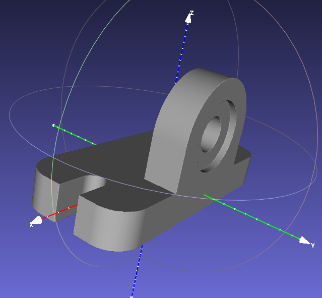
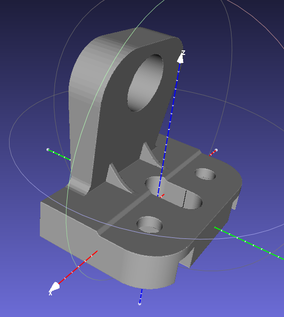
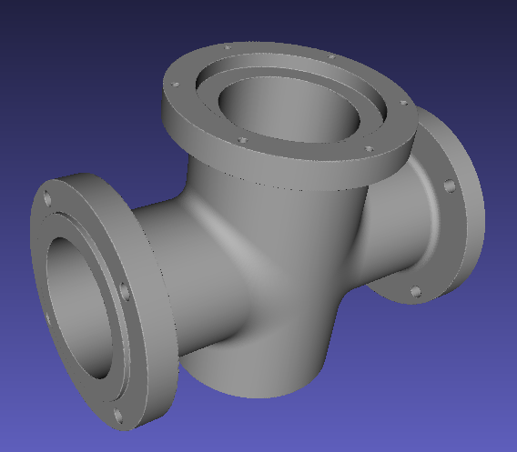
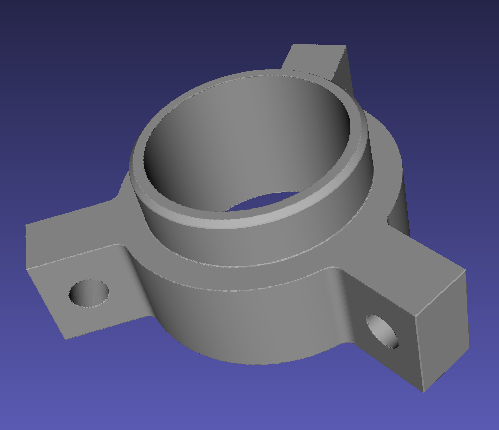
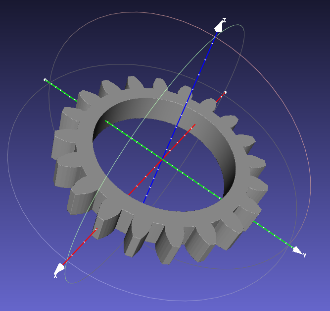
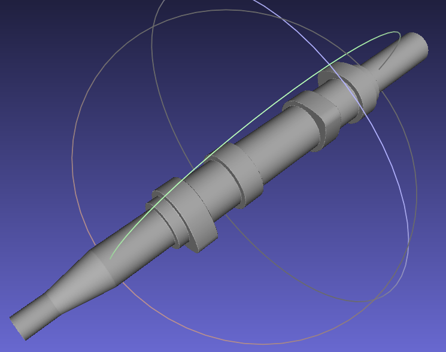
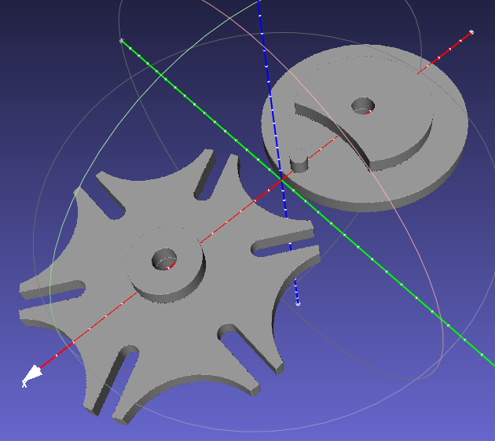
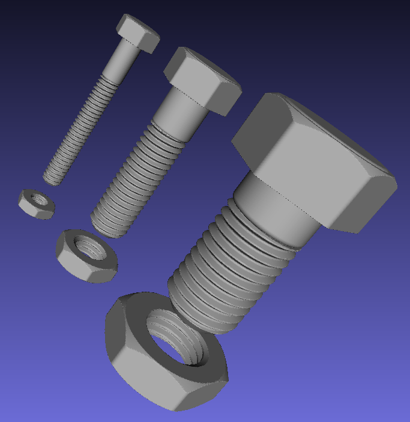
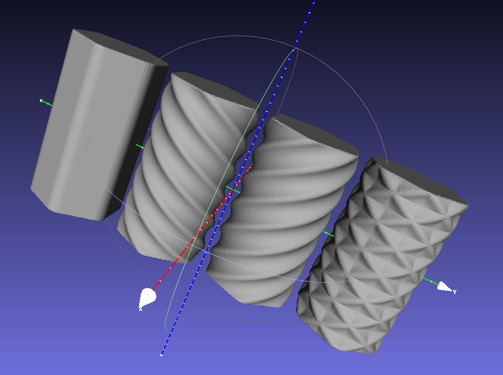
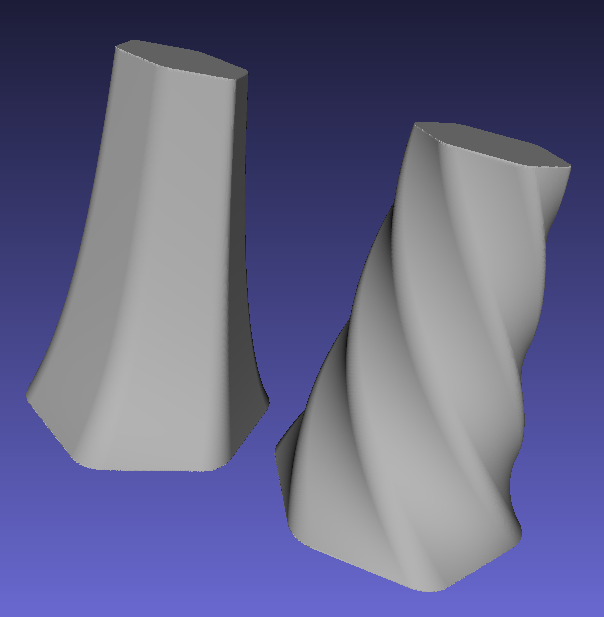
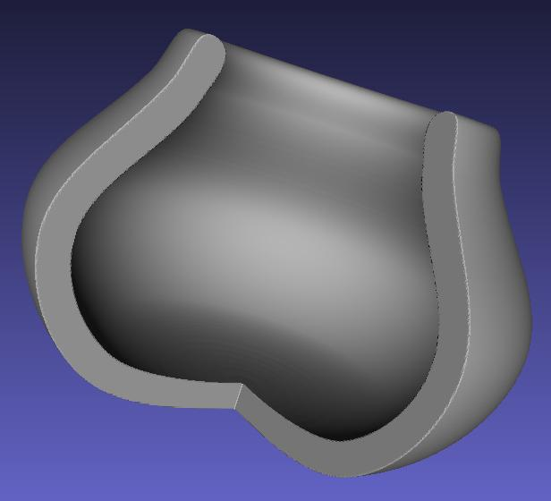
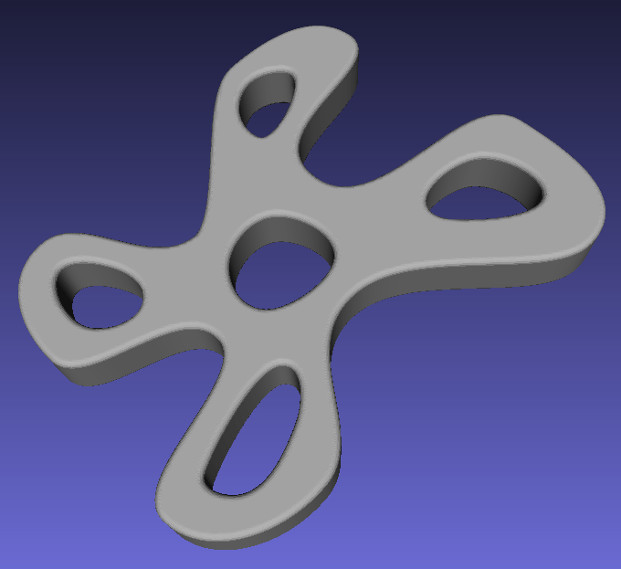

